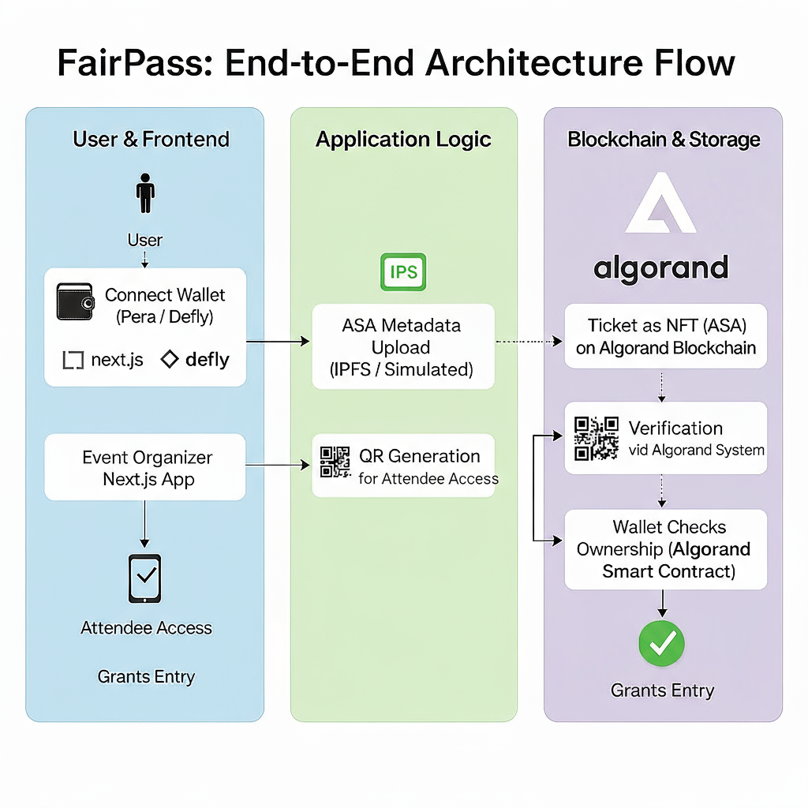

# 🎟️ FairPass – NFT-Based Event Ticketing on Algorand  
> Transparent • Authentic • Fraud-Free Event Access


---

> 🧩 Built for **AlgoBharat HackSeries-2**, adhering to the *Three Judging Pillars* —  
> **Utility**, **Scalability**, and **Code Quality**.

---

## 🌐 Overview

**FairPass** revolutionizes event ticketing by transforming tickets into **traceable NFT assets (ASAs)** on the **Algorand blockchain**.  
It prevents scalping and fraud by making every ticket verifiable, immutable, and optionally non-transferable through on-chain role controls.

---

## 🧠 Problem Statement

Event ticketing systems are plagued by:
- 🎫 Fake or duplicated tickets  
- 💰 Unauthorized resales (scalping)  
- ❌ Lack of transparent ownership validation  

FairPass eliminates these issues by **tokenizing tickets** as Algorand **ASAs** — giving both event organizers and attendees complete trust.

---

## 💡 Solution

FairPass leverages the **Algorand blockchain** to:
- ✅ Represent each event ticket as a unique **ASA (NFT)**  
- ✅ Enforce **resale rules** by assigning Zero-Address to `manager`, `freeze`, and `clawback` roles  
- ✅ Allow event creators to **mint, manage, and verify** tickets with transparent ownership records  
- ✅ Demonstrate a **mocked on-chain flow** to ensure seamless hackathon demo runtime

---

## 🧱 Architecture Overview

FairPass consists of three primary layers — **Frontend**, **Application Logic**, and **Blockchain & Storage**.



> *Users connect wallets, create events, mint NFT tickets, attach metadata via IPFS, and verify ownership through the Algorand system.*
>
> *Blockchain and storage operations are implemented using structured functional mocks for secure, predictable demo performance — maintaining real architecture flow without requiring live keys or network funds.*


## ⚙️ Tech Stack

| Layer | Tools/Frameworks |
|-------|------------------|
| **Frontend** | Next.js (React), Tailwind CSS |
| **Blockchain** | Algorand, `algosdk`, `@txnlab/use-wallet-react` |
| **Database** | Supabase *(mocked for demo)* |
| **Utilities** | `resend`, `axios`, `qrcode`, `date-fns` |
| **UI Components** | `shadcn/ui`, `radix-ui` |
| **Language** | TypeScript, JavaScript |

---

## 🧩 Core Modules

### 🎟️ 1. Event Creation
- Simulates ASA minting for NFT-based tickets  
- Defines ticket metadata (name, seat, price)  
- Implemented in `src/app/create/page.tsx`  

### 🪪 2. IPFS Upload
- Mock route `/api/upload-to-ipfs` simulates pinning JSON metadata  
- Returns a demo **CID hash** for seamless runtime  

### 🔐 3. Wallet Integration
- Uses `@txnlab/use-wallet-react` to connect to **Algorand TestNet**  
- Demo Wallet preloaded via `wallet-loader.tsx`  

### 🧠 4. Smart Contract (Mocked)
- Simulates `manager/freeze/clawback` role control  
- Locks resale if disabled (Zero Address applied)  

### 📲 5. QR Ticket Verification
- Generates and validates tickets using wallet address mapping  

## 🧩 Implementation Breakdown

### ✅ Real / Implemented Components & Logic
These modules are **fully implemented** using Next.js, TypeScript, and the specified libraries.

| Component / File | Status & Details |
|------------------|------------------|
| **Frontend/UI** | Built with Next.js, Tailwind CSS, and shadcn/ui (functional React/Radix components). |
| `src/app/page.tsx` | Fully implemented home page with marketing sections. |
| `src/app/layout.tsx` | Sets up the root layout, global providers, and fonts. |
| `src/app/providers.tsx` | Implements dynamic wallet import via `next/dynamic`. |
| `src/app/wallet-loader.tsx` | Real integration of `@txnlab/use-wallet-react` with Defly, Pera, Lute, and a Demo Wallet. |
| `src/app/host/page.tsx` | Logic for activeAddress checks, user creation, and event listing using mock data. |
| `src/app/create/page.tsx` | Full event creation form with validation and client-side logic. |
| `src/app/api/resend/route.ts` | Real email API using `resend` SDK and embedded QR generation. |
| `src/lib/utils.ts` | Fully functional helper utilities (cn, debounce, formatDate, etc.). |
| `src/lib/email-templates.ts` | Generates complete HTML email templates. |

---

### 🔴 Mocked / Simulated Components
Used to safely represent blockchain, IPFS, and database operations **without exposing keys or using real funds**, while keeping the architecture intact.

| Component / File | Mocking Detail |
|------------------|----------------|
| **Blockchain Transactions** | ASA minting, transfers, and approvals simulated with mock Asset IDs. |
| `src/lib/algorand-utils.ts` | `checkAssetHolding` and NFT minting functions return predefined or random mock IDs. |
| `src/lib/certificate-minting.ts` | Skips live blockchain calls, returns mock Asset ID. |
| `src/app/api/upload-to-ipfs/route.ts` | Generates static demo IPFS hash (`QmVitaDemoHash…`) for metadata. |
| **Database (Supabase)** | Uses mock Supabase client for in-memory operations (non-persistent). |
| `src/app/dashboard/page.tsx` | Displays mock ticket counts. |
| `src/app/mytickets/page.tsx` | Uses hardcoded mock ticket data (Asset ID 12345). |
| `src/app/ticket/view/[id]/page.tsx` | Simulates ticket metadata fetch and QR payload. |
| `src/app/api/welcome-nft/route.ts` | Updates a mock `welcome_nft_id` instead of minting. |

> 🧠 These mocks maintain accurate blockchain architecture while ensuring safe, consistent demo behavior for the hackathon.

---

## 🧩 Module Integration Flow

| Module | Input | Output | Description |
|--------|--------|---------|-------------|
| `createEvent()` | Event details | ASA metadata | Simulates NFT minting |
| `uploadToIPFS()` | Metadata JSON | Mock CID | Stores metadata |
| `connectWallet()` | — | Wallet address | Establishes connection |
| `generateQR()` | ASA data | QR Code | Displays event access QR |
| `verifyTicket()` | Wallet Addr, ASA | Boolean | Validates ticket ownership |

---

## 📘 ARC Standards & Ecosystem Alignment

| ARC | Purpose |
|-----|----------|
| **ARC-3** | NFT metadata for ticket creation |
| **ARC-20 (Planned)** | Fungible passes or loyalty tiers |
| **ARC-0010 / 0011** | Wallet connectivity & transaction signing |
| **ABI** | Contract interface compliance (future) |

## 🧭 Judging Pillar Mapping

| Pillar | Implementation |
|--------|----------------|
| **Utility & Use Case** | Provides verifiable NFT ticketing for fraud prevention using a mock-enabled blockchain flow. |
| **Scalability & Versatility** | Modular design supports events, memberships, loyalty passes, and university access systems. |
| **Code Quality & Standards** | ARC-compliant TypeScript architecture with clearly defined real and simulated components. |

### 🧩 Integration References
| Tool | Usage |
|------|-------|
| [AlgoKit CLI](https://developer.algorand.org/docs/get-started/algokit/) | Smart contract scaffolding |
| [Algorand SDK JS](https://developer.algorand.org/docs/sdks/javascript/) | Blockchain logic |
| [ARC Standards](https://arc.algorand.foundation/) | Token & NFT structure compliance |
| [AlgoExplorer TestNet](https://testnet.algoexplorer.io/) | Demo wallet & asset verification |

---

## 🔧 Local Setup & Installation

### 1️⃣ Clone Repository
```bash
git clone https://github.com/roshannn-07/fairpass
cd fairpass
```

### 2️⃣ Install Dependencies
```bash
npm install
```

### 3️⃣ Run the App
```bash
npm run dev
```

Then open the app in your browser →
👉 http://localhost:3000


### 🧩 Demo Highlights
| Feature           | Description                 | Status |
| ----------------- | --------------------------- | ------ |
| Wallet Connection | Functional via TestNet      | ✅      |
| Ticket Minting    | Mocked ASA logic            | ✅      |
| IPFS Upload       | Mocked CID simulation       | ✅      |
| QR Verification   | Live rendering via `qrcode` | ✅      |
| Resale Lock       | Smart contract logic (mock) | ✅      |
> ⚙️ *Note:* Certain Algorand and IPFS operations are functionally mocked to ensure a stable, secure demo without private keys or paid API dependencies — preserving full architectural accuracy.

---

### 🧭 Future Roadmap

- 🔗 Replace mocks with live Algorand TestNet transactions

- 🧱 Integrate with AlgoKit for contract deployment

- 📊 Add analytics dashboard for event organizers

- 🪶 Introduce fractional ownership for collaborative events  

- 🧾 Integrate PoAP (Proof of Attendance Protocol) support
  
### 🤖 AI Collaboration Statement

🧠 “AI was used as a co-developer for scaffolding and documentation,
while all blockchain and logic layers were fully human-verified.”

This ensures compliance with AlgoBharat’s AI usage rule — AI as assistant, not architect.

### 🧩 Scalability Vision

FairPass is built as a modular access token engine, not just a ticketing system.
Potential future use cases include:

- 🎓 University passes and digital certificates

- 🏟️ Sports and season memberships

- 🎬 Concerts, conventions, and PoAPs

- 💼 Private club or subscription access NFTs


### 📎 Resources
📘 Below are the key resources and documentation references used for FairPass development:

- 🌐 [Algorand Developer Portal](https://developer.algorand.org/)

- 📘 [ARC Standards Library](https://arc.algorand.foundation/)

- ⚙️ [AlgoKit CLI Docs](https://developer.algorand.org/docs/get-started/algokit/)

- 🔗 [FairPass GitHub Repository](https://github.com/roshannn-07/fairpass)


### 👨‍💻 Maintainer

**Roshan Murthy**  
B.Tech CSE | Blockchain & DApp Developer  
💻 [GitHub Profile](https://github.com/roshannn-07)

